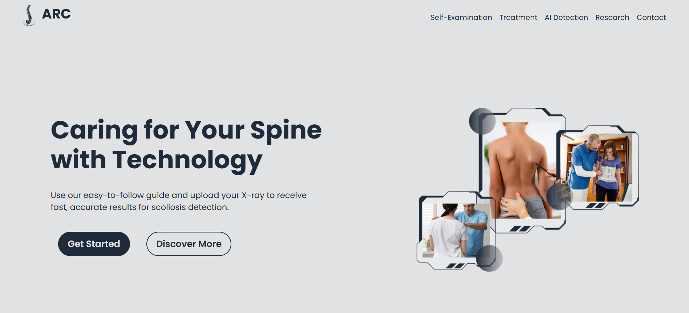
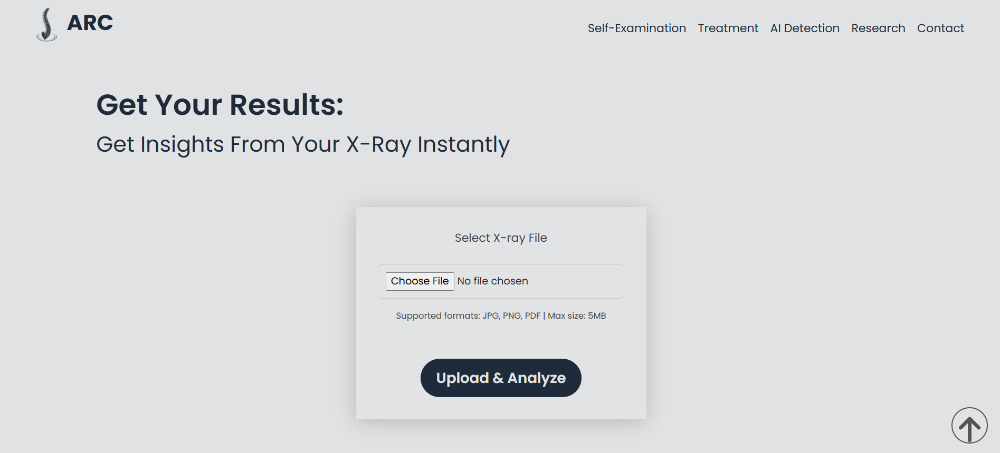
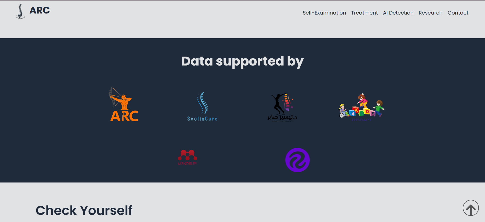

# Scoliosis Detection: Edge-Preserving Preprocessing of Spinal X-Rays Using PDEs and Deep Learning-Based Classification

## Abstract

ARC is a cutting-edge project focused on improving scoliosis diagnosis through advanced image processing and machine learning techniques.  Scoliosis, a spinal curvature and vertebral rotation, requires accurate and early detection for effective treatment. By leveraging Partial Differential Equations (PDEs) for image pre-processing and a Convolutional Neural Network (CNN) for classification, this project enhances the accuracy of spinal X-ray analysis. Additionally, U-Net is utilized for precise line segmentation to assist in Cobb angle measurement, a critical metric for assessing scoliosis severity.



## Features

- **Noise Reduction:** Pre-processes spinal X-rays using the Heat Equation and Anisotropic Diffusion for improved image clarity and edge preservation.
- **Automated Classification:** Employs a CNN to classify spinal images as either normal or indicative of scoliosis.
- **Segmentation:** Utilizes U-Net to segment spinal structures and identify key anatomical landmarks.
- **Cobb Angle Calculation:** Automates the measurement of Cobb angles using image analysis, facilitating accurate scoliosis diagnosis.

## Methodology

1. **Pre-Processing:**

   - **Diffusion Equation:** Smooths images to reduce noise while balancing edge detail.
   - **Anisotropic Diffusion:** Enhances edge preservation while minimizing noise in X-ray images.

2. **Classification:**

   - A CNN is trained on labeled X-ray images to identify scoliosis patterns with high accuracy.

3. **Segmentation:**

   - U-Net is applied to extract spinal cord structures from X-ray images, ensuring precise segmentation for angle measurement.

4. **Cobb Angle Calculation:**
   - Integrates Python-based algorithms for consistent and precise Cobb angle determination.



## Results

- **Pre-Processing Performance:** Demonstrated the strengths of Diffusion Equation and Anisotropic Diffusion in enhancing image quality.
- **CNN Classification Accuracy:** Achieved a training accuracy of 96.64% and a test accuracy of 84.58%.
- **Segmentation Performance:** U-Net attained a test accuracy of 98.74%, highlighting its efficacy in spinal segmentation.
- **Cobb Angle Analysis:** Provided accurate and reliable Cobb angle measurements critical for scoliosis assessment.

## Dataset

The project utilized a diverse dataset comprising 580 normal and 765 scoliosis X-ray scans collected from Egyptian clinics and open-source repositories. This variety ensures the robustness and generalizability of the model.



## Tools and Technologies

- **Programming Language:** Python
- **Frameworks:** TensorFlow, Keras, OpenCV
- **Models:** CNN, U-Net
- **Algorithms:** Heat Equation, Anisotropic Diffusion

## Usage

To replicate the results or build upon this work:

1. Clone the repository:
   ```bash
   git clone https://github.com/RaghadAbdelhameed/Scoliosis-Detection-Segmentation-CobbAngle-U-Net.git
   ```

## Data Repository

This repository contains code for testing, training, and validating data models. **Please note:** the actual data files (testing, validation, and training data) are not included in this repository and are listed in `.gitignore`.

## Access to Data

The data is stored separately for privacy and size considerations. If you would like to access the data for your own experiments or research, please contact us at:

📧 **[abdlrhman.mohamed02@eng-st.cu.edu.eg](mailto:abdlrhman.mohamed02@eng-st.cu.edu.eg)**
